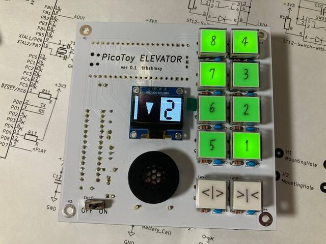
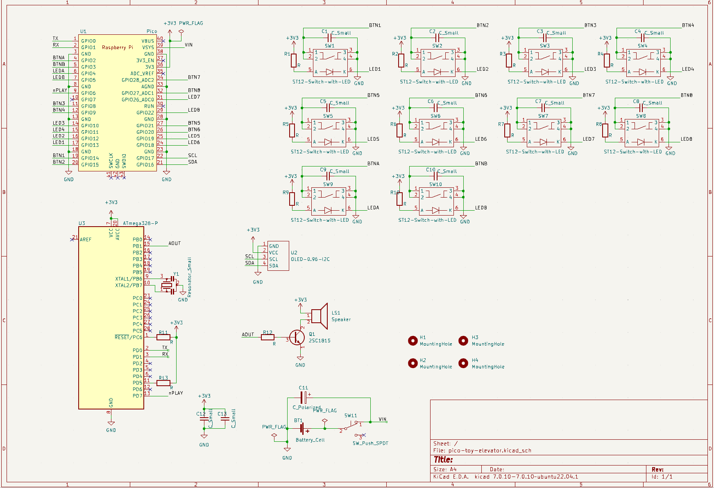
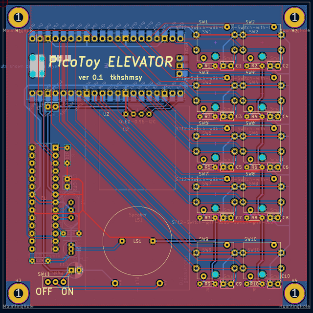

# pico-toy-elevator

This is a toy that imitates the operation of Elevator.

My son loves Elevators, going up and down for hours, and watching YouTube about it every day.  
I hope he enjoys this...

## Features
* LCD displays floors and operations
* Pressed button is lights up
* Speak according to the movement of the elevator ( in Japanese ! )
* All parts are able to get from [Akizuki Denshi](https://akizukidenshi.com/catalog/default.aspx).
* Use Raspberry Pi Pico with Rust language.

## Schematic and Layout

## Bill Of Materials
|Ref|Name|Qty|Description|Link|
|---|----|---|-----------|----|
|U1|RaspberryPi Pico|1|Micro Controller|[https://akizukidenshi.com/catalog/g/g116132/](https://akizukidenshi.com/catalog/g/g116132/) or [https://akizukidenshi.com/catalog/g/g118085/](https://akizukidenshi.com/catalog/g/g118085/)|
|U2|OLED|1|i2c, 0.96inch|[https://akizukidenshi.com/catalog/g/g112031/](https://akizukidenshi.com/catalog/g/g112031/)|
|U3|Aques Talk Pico|1|ATMega328P|[https://akizukidenshi.com/catalog/g/g109973/](https://akizukidenshi.com/catalog/g/g109973/)|
|BT1|Battery holder|1|2xAAA|[https://akizukidenshi.com/catalog/g/g110197/](https://akizukidenshi.com/catalog/g/g110197/)|
|C1,C2,C3,C4,C5,C6,C7,C8,C9,C10,C12,C13|Capacitor|12|0.1uF|[https://akizukidenshi.com/catalog/g/g115927/](https://akizukidenshi.com/catalog/g/g115927/)|
|C11|Capacitor polar|1|100uF|[https://akizukidenshi.com/catalog/g/g105002/](https://akizukidenshi.com/catalog/g/g105002/)|
|LS1|Speaker|1|8ohm 0.5W|[https://akizukidenshi.com/catalog/g/g109797/](https://akizukidenshi.com/catalog/g/g109797/)|
|Q1|2SC1815|1||[https://akizukidenshi.com/catalog/g/g106475/](https://akizukidenshi.com/catalog/g/g106475/)|
|R1,R2,R3,R4,R5,R6,R7,R8,R9,R10|Resistor 220|10|LED limit||
|R11,R13|Resistor 10K|2|Pull up||
|R12|Resistor 270|1|Speaker drive||
|SW1,SW2,SW3,SW4,SW5,SW6,SW7,SW8,SW9,SW10|Push Switch with LED|10|select any color|Green [https://akizukidenshi.com/catalog/g/g102009/](https://akizukidenshi.com/catalog/g/g102009/) Red [https://akizukidenshi.com/catalog/g/g102010](https://akizukidenshi.com/catalog/g/g102010) Yellow [https://akizukidenshi.com/catalog/g/g115372](https://akizukidenshi.com/catalog/g/g115372)|
|SW11|Slide Switch|1|Power SW|[https://akizukidenshi.com/catalog/g/g115707/](https://akizukidenshi.com/catalog/g/g115707/)|
|Y1|Resonator|1|16MHz|[https://akizukidenshi.com/catalog/g/g109576/](https://akizukidenshi.com/catalog/g/g109576/)|

## License
* MIT

## Author
* tkhshmsy@gmail.com
